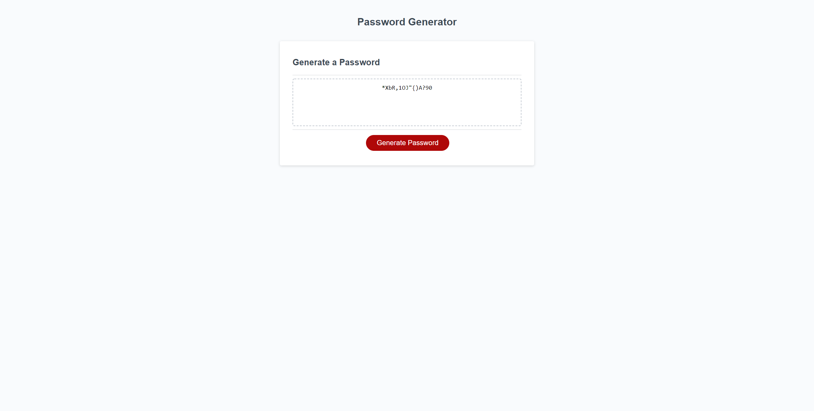

# Password-Generator
Code to properly create random password

## About the Project

Password Generator is a website developed for the purpose of creating a random password for the user. The user is prompted with 4 questions: how long the password should be, whether to include numbers, whether to include lower case characters, whether to include upper case characters, and whether to include special characters. The program will then generate a password that includes all the criteria the user requests.

## Built With
* CSS
* Java Script